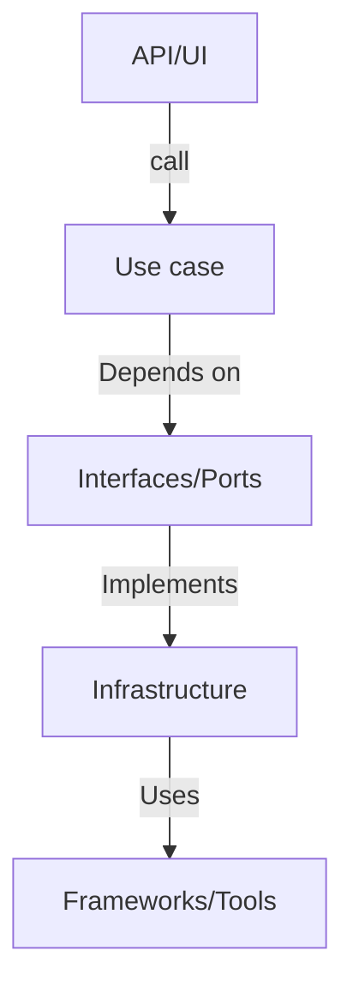
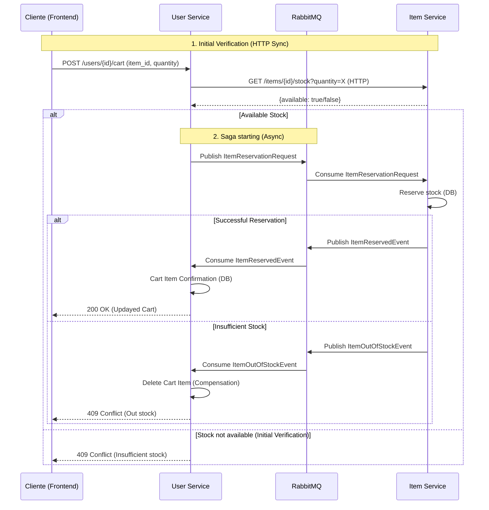
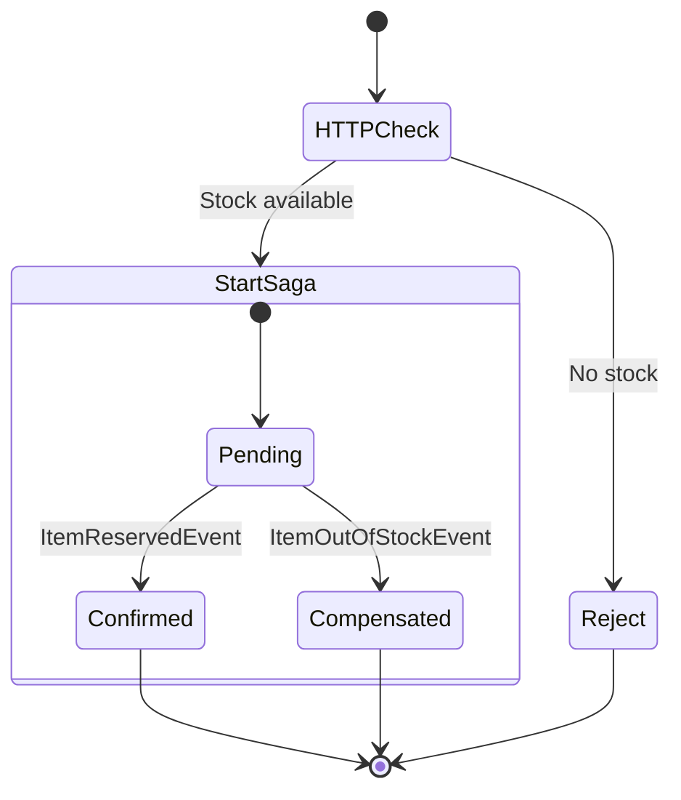

# Backend Task - Clean Architecture

This project is a very naive implementation of a simple shop system. It mimics in its structure a real world example of a service that was prepared for being split into microservices and uses the current Helu backend tech stack.

## Goals

Please answer the following questions:

1. Why can we not easily split this project into two microservices?

In general, the project is well-structured, we can say that this project is a small modular monolith with two modules and
the code in general is clean and easy to read, with static typing enforcement that is a good practice.

However, this project is not easy to split into two microservices mainly because the modules are not independent of each other. 
They are tied and not fully decoupled. User module has a clear dependency on Item module, importing Model and some methods/functions.
Also, the business logic or core business if you prefer, is not separated from external resources (I explore deeper in the next point)

And taking into account that this is a small monolith, both modules use the same database, so they are not fully decoupled.

------------------------

2. Why does this project not adhere to the clean architecture even though we have separate modules for api, repositories, usecases and the model?

Probably the main characteristic of the clean architecture is that the business logic is separated from the external resources,
meaning that the business logic should not depend on the database, web framework, ORM, connection clients etc.

The business core should be agnostic to the external resources. This helps to keep the business logic clean and easy to test but also
easy to migrate. For example, we can change the database from Postgres to MongoDB or the web framework from FastAPI to Flask without changing the business logic.
But in this project we cannot do this easily, because some use_cases are directly dependent on the database and ORM. So, if I want to change postgres to MySQL,
this will be very complex and requires a lot of changes in the codebase.

As was mentioned before, in a clean architecture the business logic is agnostic, lives in an isolated core.
The other cores are external and can be databases, webFrameworks, ORMs, etc.

We can say that the general schema of the clean architecture is something like this:



As we see, the use_cases depends on Interfaces (ABS classes in python) and not of concrete implementations.

In this project, use_cases depends on concrete implementations of the interfaces (repositories), which violates the clean architecture principles..

In conclusion, in this project core business is not fully agnostic, use_cases depends on concrete implementations of the interfaces (repositories) and
as was mentioned earlier, the modules are not fully decoupled (user depends on item module).

-----------------------

3. What would be your plan to refactor the project to stick to the clean architecture?

Note: I'm going to assume several things here.

My plan is the next four main points to refactor the project to stick to the clean architecture and split it into two microservices:

    3.1. Separate the business logic from the external resources (databases, web frameworks, ORMs, etc.)
    3.2. Make the modules independent of each other (decoupled)
    3.3. Make the dependencies between modules more explicit (shared contracts)
    3.4. Every microservice has to have its own database independently of the other microservices for fully decoupling (I explore this latter)

To achieve this I suggest the next structure for the two microservices in a monorepo for simplicity: 

```text
be_task_ca/
├── shared_contracts/
│   ├── pyproject.toml
│   ├── schemas/ (for http clients or APIs calls between microservices)
│   │   ├── __init__.py
│   │   ├── item.py
│   │   └── user.py
│   └── events/ ( In case that we want to use events or implement a saga patter.)
│       ├── __init__.py
│       ├── item_events.py
│       └── user_events.py
├── user_service/
│   ├── Dockerfile
│   ├── pyproject.toml
│   ├── core/
│   │   ├── entities/
│   │   │   ├── user.py
│   │   │   └── cart.py
│   │   ├── use_cases/
│   │   │   ├── create_user.py
│   │   │   ├── add_to_cart.py
│   │   │   └── list_cart.py
│   │   │   └── More use cases...        
│   │   └── contracts/ (interfaces, ABs classes, Ports)
│   │       ├── user_repository.py
│   │       ├── item_client.py
│   │       └── event_publisher.py
│   │       └── More contracts if is needed...
│   ├── adapters/
│   │   ├── db/
│   │   │   ├── models/
│   │   │   │   ├── user_model.py
│   │   │   │   └── cart_item_model.py
│   │   │   ├── session.py
│   │   │   └── alembic/
│   │   ├── repositories/
│   │   │   └── user_repository.py
│   │   └── clients/
│   │       ├── http_item_client.py
│   │       └── rabbitmq_event_publisher.py
│   ├── api/
│   │   ├── routes/
│   │   │   ├── user.py
│   │   │   └── cart.py
│   │   └── schemas/
│   │       └── user_schemas.py
│   ├── tests/
│   │   ├── unit/
│   │   └── integration/
│   └── app.py

├── item_service/ (the same structure as user_service)
│   ├── Dockerfile
│   ├── pyproject.toml
│   ├── core/
│   │   ├── entities/
│   │   │   └── item.py
│   │   ├── use_cases/
│   │   │   ├── create_item.py
│   │   │   └── manage_stock.py (get_all)
│   │   └── contracts/
│   │       ├── item_repository.py
│   │       └── event_handler.py
│   ├── adapters/
│   │   ├── db/
│   │   │   ├── models/
│   │   │   │   └── item_model.py
│   │   │   ├── session.py
│   │   │   └── alembic/
│   │   ├── repositories/
│   │   │   └── item_repository.py
│   │   └── clients/
│   │       └── rabbitmq_event_handler.py
│   ├── api/
│   │   ├── routes/
│   │   │   └── item.py
│   │   └── schemas/
│   │       └── item_schemas.py
│   ├── tests/
│   │   ├── unit/
│   │   └── integration/
│   └── app.py
└── core-adapter/
    ├── docker-compose.yml
    ├── scripts/
    │   └── init_db.sh
    └── rabbitmq/
        └── definitions.json
```

**Key points:**

* Shared contracts:
Even that the modules (now microservices) are decoupled, they need to communicate with each other. User service will need
to verify the item availability before adding to the cart for example. Shared_contracts is a dependency that needs to be installed
in both microservices in this case using poetry (the project use poetry but could be trough pip or any other package manager).
This shared_contracts contains schemas or events (for a message broker and Sagas) and indicates what the microservices can expect from each other,
is not a concrete implementation, is just a contract. Each microservice that install it, needs to implement the contract.
This is a good practice because it helps to keep the microservices decoupled and easy to test.

* Microservices:
It was implemented two microservices (user_service and item_service) with the same structure.

* Core business:
The core business for each microservice are in the folder core/. 

* Entities: 
represents pure business logic, agnostic, not depends on anything.

* Use cases:
For use_cases we cant think in a little orchestrator for all the "steps" that are involved in the use case. For example the use case create user
implies several steps, like validate the data, create the user in the database, send an email, etc. So we can think that use_cases are orchestrators.
This use_cases depends on interfaces (contracts) and not of concrete implementations. The contracts are in the folder contracts/.

* Contracts:
They are interfaces (ABs classes in python). In clean architecture is usually called ports (I prefer contracts to avoid confusion).
They are the entry points for the core business. The core business should not depend on concrete implementations, but on contracts.
It's the way that the inner layer (core business) communicates with the outer layer (external resources).

* Adapters:
The external resources like DB, clients etc. Here is implemented the concrete implementations of the contracts (repositories, clients, etc).
I decided to call adapters instead of infrastructure to avoid confusion with Infra as a code, terraform, etc.

* Repositories:
As was mentioned before, the repositories are the concrete implementations of the contracts.
They are the entry point for the core business to access the data.

* API:
The API layer is the entry point for the microservice. It should not depend on the core business, but on the contracts.\.


## MessageBroker (could be RabbitMQ) and http client:

As we can see I decided to implement a Saga Pattern but also a Http client for the communication between microservices.

**Why a saga pattern?**
The reason of the saga is that I assume that these two microservices are going to be used in a bigger system, for example use another service
to process payments or a service to create orders etc. So we need to ensure integrity of the data. If something is wrong, be able to validate which service failed 
and rollback the changes, gives a compensation etc.

**Why a Http client?**
The reason for the Http client (could be using httpx or request whatever you prefer) is because for a better experience I think a fast 
and synchron consult for the item availability is better than a message broker.

## Sequence of a Saga in Add to cart item:



## Saga state machine:


But the beauty of this clean architecture is that you can choose the best approach for your needs. At the beginning we can decided only use an http client, but latter migrate to a message brker.
And you only "disconnect" the client and "connect" the Message broker implemented the interface.

## Independent DataBases:

For fully decoupled I decided to use two different databases for each microservice. This is a good practice an ensure fully independency.
However, I'm aware that for example in clouds (like AWS) the storage is probably the most expensive resource.

In some cases for early startups that have a really limited budget, in order to reduce costs they can opt for use one DB instance (AWS RDS)
and use it with the different microservices. But this is not a good practice and I don't recommend it.

But if is not an option to have independent databases, we can make a "logical" separation of the databases using schemas or unique prefixes for the tables.
Again, is not ideal (at the end in the background still there is some tied) but is better than nothing.

## Alembic (database migration tool):

I decided to use Alembic for database migration, is a good practice and is the most used tool for this purpose in the python community.
We can think in Alembic as a tool to manage the database schema, like a version control system for the database.


------------------------


4. How can you make dependencies between modules more explicit?

As Was mentioned in the prev Point, the idea is to make the dependencies between modules more explicit using shared contracts.
I decided to make the architecture for both microservices in a monorepo for simplicity, but in a real world example we can have two different repositories for each microservice.

The shared contracts is a dependency that needs to be installed in both microservices in this case using poetry (the project use poetry but could be trough pip or any other package manager).

*Please do not spend more than 2-3 hours on this task.*

Stretch goals:
* Fork the repository and start refactoring
* Write meaningful tests
* Replace the SQL repository with an in-memory implementation

## References
* [Clean Architecture by Uncle Bob](https://blog.cleancoder.com/uncle-bob/2012/08/13/the-clean-architecture.html)
* [Clean Architecture in Python](https://www.youtube.com/watch?v=C7MRkqP5NRI)
* [A detailed summary of the Clean Architecture book by Uncle Bob](https://github.com/serodriguez68/clean-architecture)

## How to use this project

If you have not installed poetry you find instructions [here](https://python-poetry.org/).

1. `docker-compose up` - runs a postgres instance for development
2. `poetry install` - install all dependency for the project
3. `poetry run schema` - creates the database schema in the postgres instance
4. `poetry run start` - runs the development server at port 8000
5. `/postman` - contains an postman environment and collections to test the project

## Other commands

* `poetry run graph` - draws a dependency graph for the project
* `poetry run tests` - runs the test suite
* `poetry run lint` - runs flake8 with a few plugins
* `poetry run format` - uses isort and black for autoformating
* `poetry run typing` - uses mypy to typecheck the project

## Specification - A simple shop

* As a customer, I want to be able to create an account so that I can save my personal information.
* As a customer, I want to be able to view detailed product information, such as price, quantity available, and product description, so that I can make an informed purchase decision.
* As a customer, I want to be able to add products to my cart so that I can easily keep track of my intended purchases.
* As an inventory manager, I want to be able to add new products to the system so that they are available for customers to purchase.